<p align="center">
  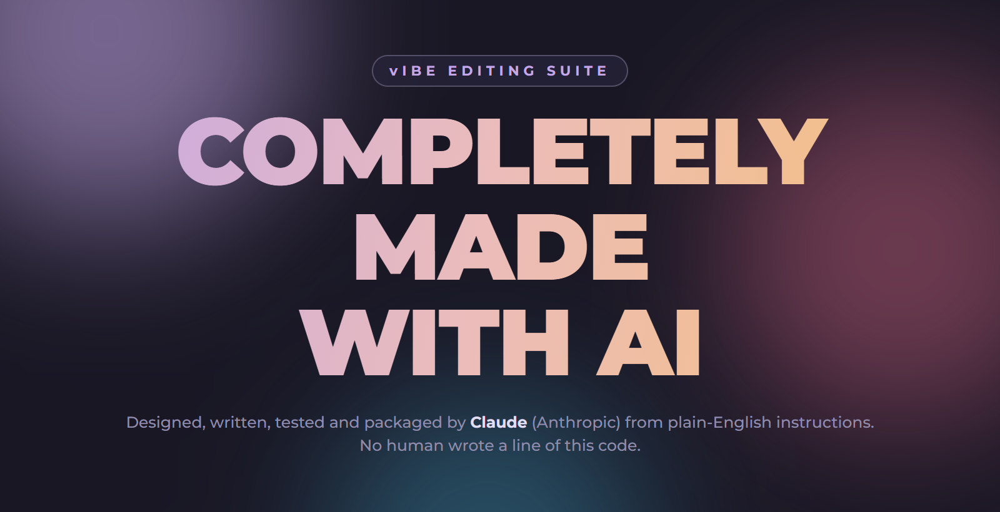
</p>

<h1 align="center">Vibe Video Editor</h1>

<p align="center">
  A Windows video editor with goofy PowerPoint-style transitions, keyframes, multi-track audio and 4K export.<br>
  <b>Every line of it was written by AI.</b>
</p>

<p align="center">
  <a href="https://github.com/phsrp/Vibe-video-editor/releases/latest"></a>
  
  
</p>

---

> ## 🤖 Made completely with AI
> This whole app (the editor, the transitions, the exporter, the installer, the updater and this page) was built by
> **Claude** (an AI made by Anthropic) through a conversation. The person who asked for it does not write code: they
> described what they wanted in plain English, and the AI wrote, ran, tested and fixed everything itself.
> Expect the occasional rough edge, and please report anything odd under **Issues**.

---

## Screenshots

**Home page.** Start a new project, open one, or jump back into a recent one. You can keep several projects open at once, each in its own tab.

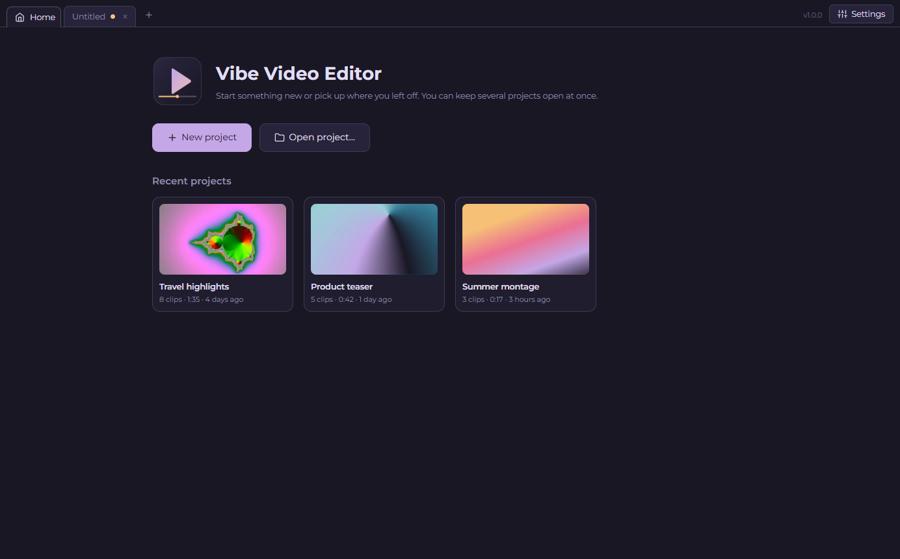

**The editor.** Media bin, live preview with the on-screen Transform box, a timeline with an overlay video track (here called *Reaction cam*) above the main video, separate audio lanes with waveforms, and an Inspector whose sections fold open and closed. The Media, Library and Inspector panels can each be hidden.

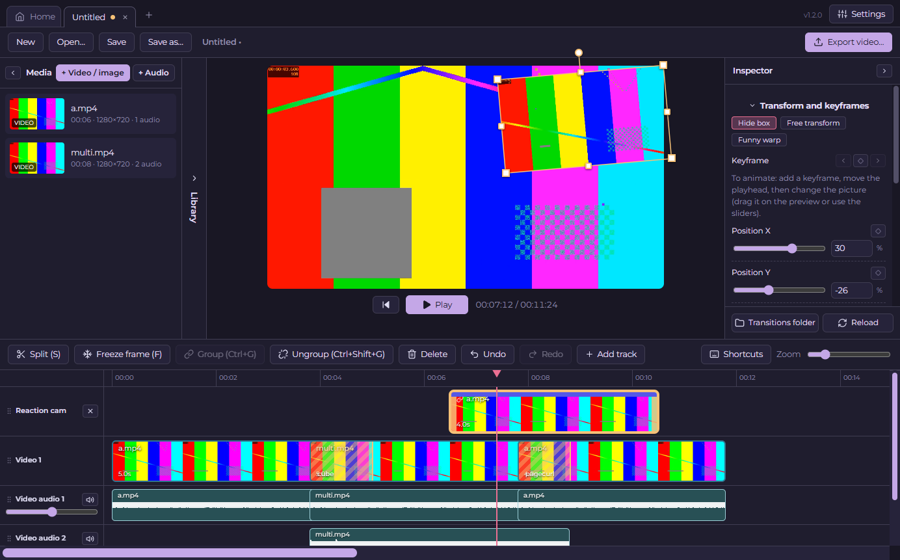

**Light theme.** Rosé Pine (dark) is the default; Rosé Pine Dawn is one click away in Settings.

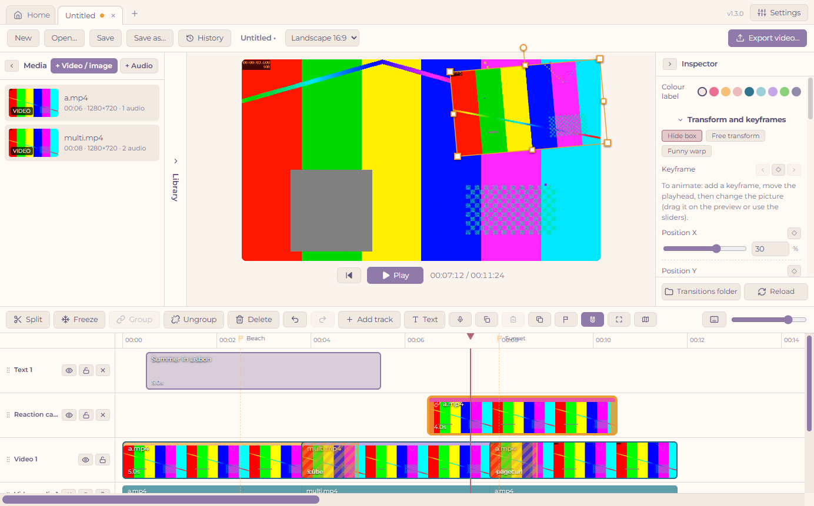

**Export tab.** Exporting has its own tab: pick the resolution, frame rate, video format, file type and audio quality on the left, and **watch your video being made** on the right, with a progress bar, time so far and time left.

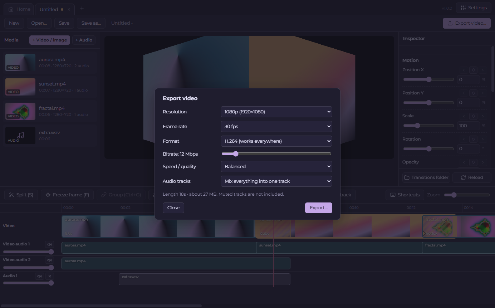

**Colour tab.** Colour correction with a live preview. Nothing reaches the clip until you press Apply.

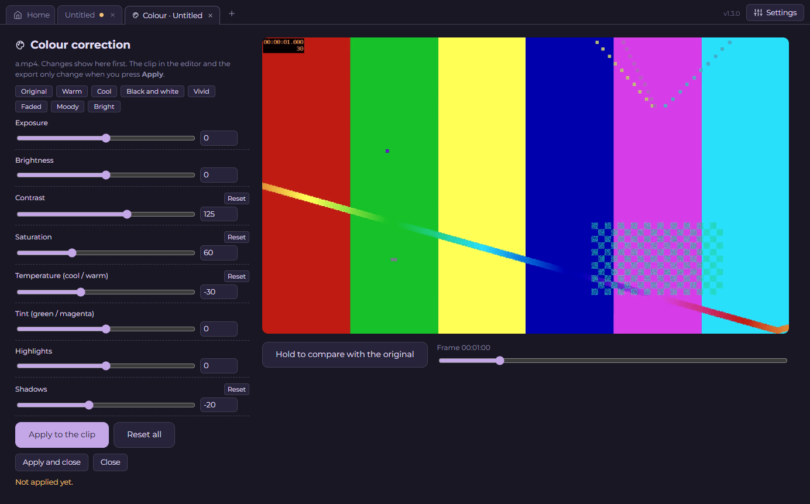

**Library.** Keep the videos, images and sounds you use again and again (an intro, a logo, music, sound effects) in one folder and use them from any project.

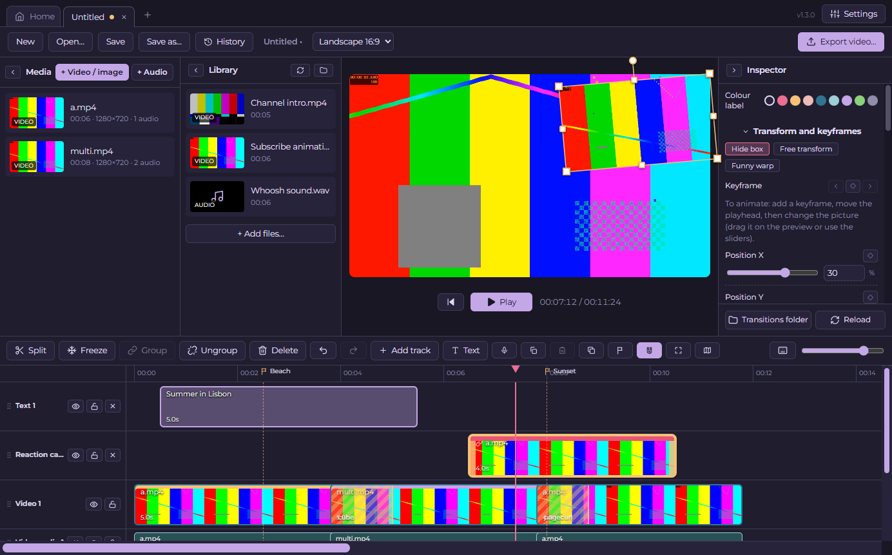

## Features

### Editing
- **Import** videos, images and audio files (button or drag-and-drop from Explorer).
- **Timeline:** drag clips to reorder, drag their edges to **trim**, **split** at the playhead, zoom in and out, undo and redo.
- **Select like in Explorer:** drag a box around clips and audio to select several, or hold Ctrl/Shift to add to the selection.
- **Groups:** group any mix of video and audio clips so they move together; ungroup when you are done.
- **Readable lengths:** long clips show their length as minutes and seconds (for example 52m 19s) instead of a big number of seconds.
- **Freeze frame:** save the exact frame under the playhead as an image and insert it. Drag its edge (or type seconds) to hold it as long as you like.
- **Inspector sections that fold away:** *Transform and keyframes* and *Transition* are dropdowns you can open and close; the editor remembers which ones you left open.
- **Transform box:** select a clip and a box appears on the preview. Drag inside it to **move**, drag a corner inwards to make the picture **smaller** (outwards for bigger), and drag the round handle to **rotate**. Press **Free transform** to let the corners (and the side handles) **stretch** the picture wider or taller instead.
- **Keyframes made easy:** press the diamond to add a keyframe, move the playhead, then change the picture (drag it on the preview or use the sliders). Another keyframe is added for you. Position, scale, stretch, rotation and opacity animate together, and each can also have its own diamond. Keyframes show on the timeline and can be dragged to retime.
- **Easing:** choose how the change between two keyframes feels, from seven ready-made styles or your own **Custom curve** (see [Easing](#easing) below).
- **Funny warp:** drag the four corners of the picture anywhere to bend it (a corner pin), also with keyframes and easing.
- **Overlay video tracks:** **Add track** asks for a **Video** or **Audio** track. A video track is a layer that sits on top of the one below it, and its clips can start at any time (picture-in-picture, stickers, reaction videos). A video's own sound comes along as grouped audio.
- **Drag clips between tracks:** drag a video clip up or down onto another video track and it moves there (the track you are over is outlined). A clip from the main video track can be dragged up onto an overlay track, and an overlay clip can be dragged down onto the main track, where it goes back into the sequence. Audio clips can be dragged onto other audio tracks too. A video's sound travels with it.
- **Rearrange and rename tracks:** drag any track by its label to move it up or down (higher video tracks are drawn on top, and you can pull audio tracks up next to the video). Double-click a track's name to rename it.
- **Waveforms:** audio clips show their sound as a sharp waveform (drawn like DaVinci Resolve's), so you can see where speech or a beat starts and stops.
- **Hide panels:** the Media, Library and Inspector panels can be folded away to give the preview more room.
- **Bigger timeline scroll bar:** easy to grab when you are scrolling through a long recording.
- **Smooth pause:** pausing the preview keeps the picture on screen instead of flashing.
### Titles, text and masks
- **Text and titles:** press **Text** (or `T`) to add text at the playhead. Pick a font, size, colour, outline, shadow or background box, and how it appears and disappears (fade, pop, slide up, typewriter). Quick looks: Title, Subtitle, Lower third, Neon and Typed. Text moves, scales, rotates and animates with keyframes like any clip.
- **Masks:** show only part of a clip with a **rectangle**, an **ellipse**, or a shape you **draw freehand around a subject** (a lasso). Add a soft edge, grow or shrink it, or invert it. The mask has its own Mask X / Y / size keyframes, so it can follow a subject that moves.
- **Smart select (AI):** draw a loose loop around a subject and an AI model finds its exact edges (on the frame you are looking at), turning it into a mask. It runs on your own PC, with no account and no internet once the model is downloaded. The button is **greyed out until you download the model** (about 45 MB, a one-time download from the Mask section of the Inspector). It works best on a clear subject.
- **Mask tracking:** after you draw a freehand or smart mask on a video clip, a popup asks **"Follow the subject?"** and for how long. Choose **Track** and the AI looks for the subject again through that time (with a progress bar and a Cancel button). The AI runs on your **graphics card** when your PC has one that supports it, which makes tracking many times faster (a few seconds for a 6-second clip on a modern card); on a PC without one it falls back to the processor, which takes about 2 seconds per look and moves and resizes the mask to follow it. It follows the subject's position and size, not its changing outline. Choose **Don't track** and the mask stays put for the whole clip.
- **Click points:** a pen-style tool. Click to place the points of a shape around the subject (click the first point, double-click or press Enter to finish), then drag any point to adjust it, double-click the outline to add a point, or right-click a point to remove it.
- **Mask bar on the timeline:** every mask shows as a purple **Mask** bar on its clip. Drag its ends to make the mask shorter or longer, drag the middle to move it, or press **x** to delete it. Outside the bar the clip shows normally.

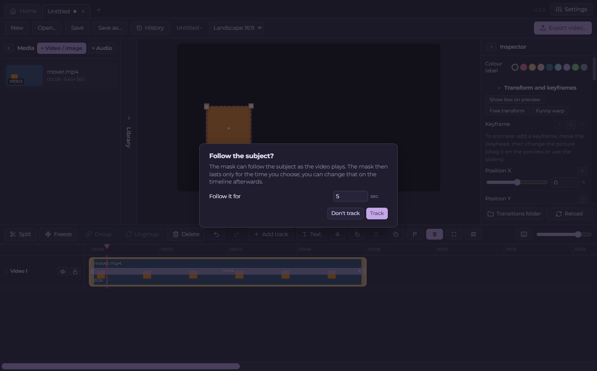

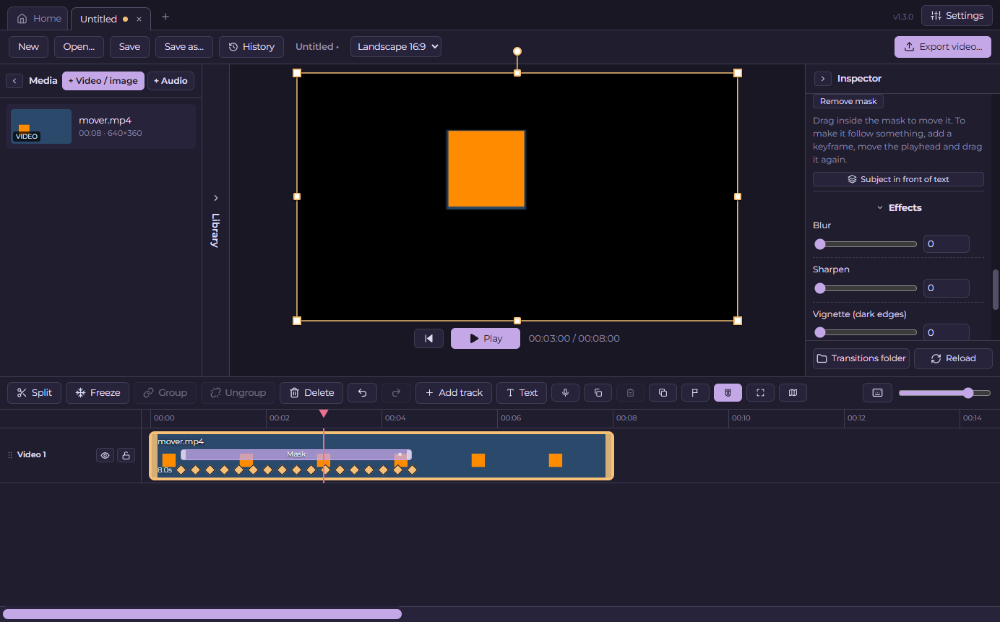

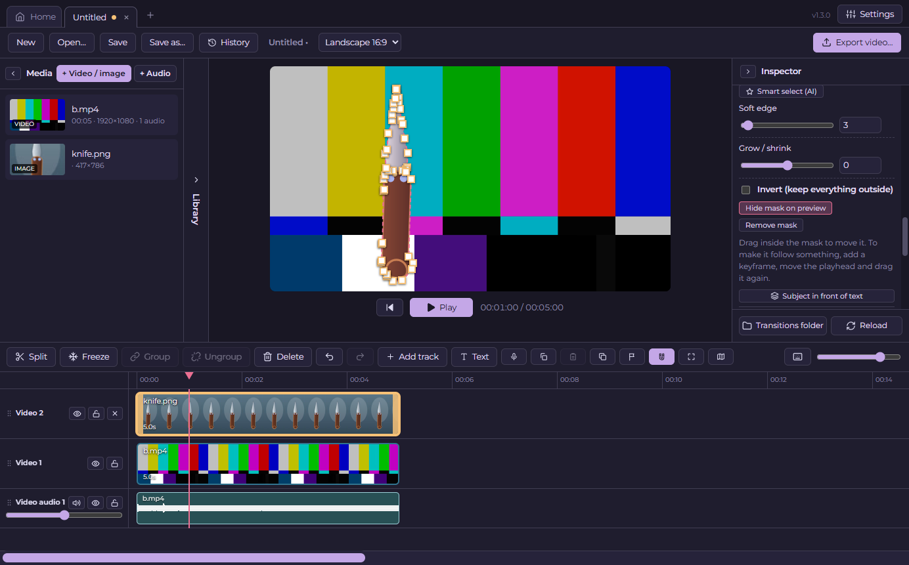

- **Subject in front of text:** with a mask on a clip, press **Subject in front of text** and the editor puts a masked copy of the clip on a new track at the top. Put your text on a track below it and the subject stands in front of the words.

### Effects, colour and speed
- **Effects:** blur, sharpen, vignette (dark edges) and glow, and **chroma key** (green screen) with a colour picker, strength, soft edge and spill removal.
- **Colour correction has its own tab:** exposure, brightness, contrast, saturation, temperature, tint, highlights and shadows, with looks like Warm, Cool, Black and white, Vivid, Faded and Moody. You see the changes in the tab first (hold a button to compare with the original) and they only reach the clip and the export when you press **Apply**.
- **Speed and reverse:** slow motion and fast forward from 0.1× to 8× (the sound keeps its pitch), and play a clip **backwards**. Reversed clips take a moment to prepare for the preview; the export has the reversed sound too.
- **Vertical and square videos:** the shape next to the project name switches between Landscape 16:9, Vertical 9:16, Square 1:1, Portrait 4:5, Classic 4:3 and Cinema 21:9. Preview and export follow it, and a **Fill the frame** button crops a clip to cover it.

### Timeline tools
- **Snapping:** clips, the playhead and markers click onto each other's edges while you drag (the magnet button, or `N`).
- **Markers:** flags on the ruler (`M`). Click to jump, drag to move, double-click to name them.
- **Copy, paste and duplicate** (`Ctrl+C`, `Ctrl+V`, `Ctrl+D`), including keyframes, effects and groups.
- **Lock and hide tracks:** lock a track so its clips cannot be changed, or hide it so it is not shown or exported (a hidden audio track is silent).
- **Colour labels:** a coloured stripe on clips, to find things at a glance.
- **Zoom to fit** (`Shift+F`) and an optional **mini timeline**: an overview of the whole project under the timeline, that you can turn on or off (off by default).
- **Voice-over:** press **Record** (`R`), count down from 3, speak while the video plays, then press it again. The recording lands on a "Voice-over" track at the playhead and is kept in Documents > Vibe Video Editor Projects > Voice-overs.
- **Loudness:** select an audio clip and press **Normalise loudness** to match a target (-14 LUFS for YouTube, -16 for podcasts, -23 for TV), or normalise the whole export.
- **Version history:** the **History** button lists earlier copies of the project (kept when you save and every few minutes). Open one as a new project, or restore it here.

### Library
- The **Library** panel (next to the Media panel; it starts folded away, click **Library** to open it) shows everything in **Documents > Vibe Video Editor Library**.
- Drag an item onto the timeline, or double-click it to add it. Videos, images and audio files all work, and they are only added to a project when you use them.
- **Add files…** copies files into the library, **Open library folder** opens it in Explorer, and the refresh button picks up files you dropped in by hand.
- If the library is empty it says **Upload your own** and gives you a button to the folder.

### Easing
Easing decides how a value (position, size, rotation, opacity or the warp) travels from one keyframe to the next. Stand on a keyframe (the diamond is filled) and pick its easing in the Inspector. The easing belongs to the keyframe it starts from, and applies to the stretch up to the next keyframe.

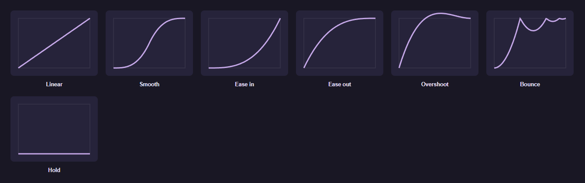

| Easing | What it does |
| --- | --- |
| **Linear** | Moves at a constant speed, with no slowing down. |
| **Smooth** | Starts slowly, speeds up, then slows down again. Good for most things. This is the default. |
| **Ease in** | Starts slowly and speeds up towards the next keyframe. |
| **Ease out** | Starts fast and slows to a gentle stop. |
| **Overshoot** | Goes slightly past the target and settles back. Feels springy. |
| **Bounce** | Lands on the target and bounces a few times, like a ball. |
| **Hold** | Does not move at all until the next keyframe, then jumps. Good for sudden changes. |
| **Custom curve** | Draw it yourself (below). |

**Custom curve.** Choose **Custom curve…** and a graph appears. The left edge is the first keyframe and the right edge is the next one. The curve shows the progress: the higher it is, the closer the value is to its target. Drag the two **round handles** to reshape it:
- A steep part of the curve means fast change, and a flat part means slow change.
- Pull a handle above the top or below the bottom to make the value go past its target and come back (an overshoot) or dip the other way first (an anticipation).
- The dotted diagonal is Linear, for comparison. Changes show in the preview straight away.

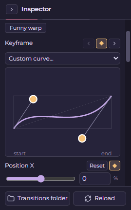

Every keyframe can have its own easing, and the **Funny warp** keyframes have the same choices.

### Transitions
- **18 PowerPoint-style transitions**, where the whole frame does the effect: cube, doors, curtains, page curl, peel, fall over, fracture, shred, crush, wind, vortex, ripple, spin, rotate, push, wipe, zoom and fade.
- Pick one per cut and set its length (0.2 to 4 seconds). Preview it with one click.
- **Add your own:** transitions are plain `.glsl` files in the [gl-transitions](https://gl-transitions.com/) format. Drop a new file into the transitions folder, press **Reload**, and it appears. No rebuild needed.

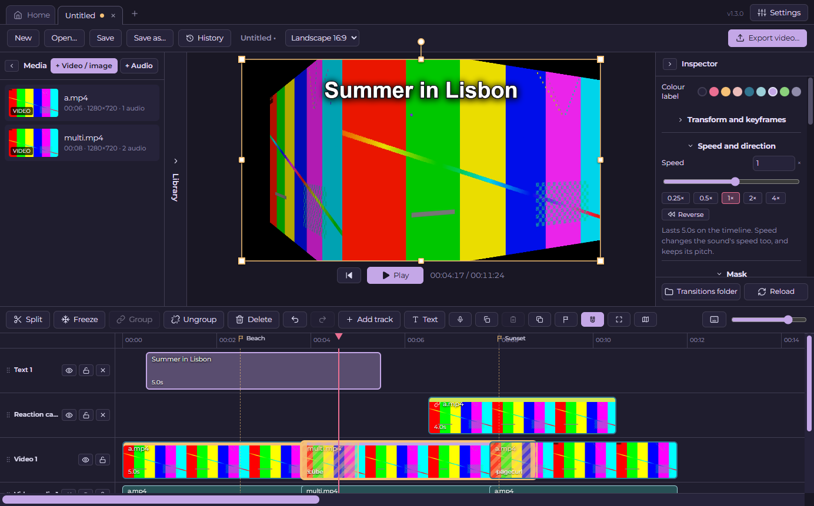

### Audio
- A recording with several audio streams (for example game + microphone) shows each stream as **its own lane** with its own volume and mute.
- Add extra audio files (music, voice-over) on their own tracks.
- **Volume up to 200%:** every audio lane and track has a volume slider from 0 to 200% (above 100% boosts it past the original). Select an audio clip and the Inspector shows the same slider, a number box and a **Mute** button.
- **Detach** one stream, or all of a clip's audio, to move, trim or delete it on its own, and **group** it back later.
- Audio crossfades automatically during transitions.

### Projects
- **Save and open** projects as `.json` files. Your videos are referenced, not copied.
- **Projects folder:** new projects are saved in **Documents > Vibe Video Editor Projects** by default. The Home page has a **Projects folder** button that opens it.
- **Autosave** every 15 seconds. If the editor closes before you save (or restarts for an update), the project **comes back by itself** the next time you open it.
- **Home page** with your recent projects, and **tabs** so you can work on several projects at once.

### Export
- Exporting has its **own tab** (press **Export video…** at the top right). It stays open next to your project, shows its progress in the tab title, and you can keep editing while it is open.
- **Watch it render:** the right side shows the video as it is being made. Effects (transitions, motion, overlays) show frame by frame, then a live preview of the final encode.
- **1080p, 2K or 4K**, **24, 30 or 60 fps**, **H.264 or H.265**, adjustable **bitrate**, and a speed/quality setting.
- **Graphics card encoding:** choose **NVIDIA (NVENC)**, **AMD (AMF)** or **Intel (Quick Sync)** as the encoder to let your graphics card do the video encoding. It needs a graphics card with a video encoder (an NVIDIA GeForce GTX 600 or newer or any RTX, an AMD Radeon RX 400 or newer, or Intel built-in graphics from the 2nd generation Core on) and up-to-date drivers. The Export tab tells you which graphics card it found and only lets you pick the ones that really work. In a test on an NVIDIA RTX 4080 SUPER, a 6-minute 2K clip exported about 4 to 5 times faster as H.265 and 10 to 40% faster as H.264. The processor option works on every PC.
- **Presets:** one click for YouTube 1080p or 4K, TikTok / Reels / Shorts, Instagram square and portrait, small files under 10 MB or 25 MB (the bitrate is worked out for you), a 4K master, or a quick draft.
- **Sound only:** make an MP3, M4A or WAV file instead of a video.
- **Loudness:** optionally normalise the whole sound to -14, -16 or -23 LUFS.
- **File type:** MP4, MKV or MOV. **Audio quality:** 128, 192, 256 or 320 kbps.
- Mix all audio into one track, or **keep every track separate** in the file.
- Progress bar with time so far and an estimate of the time left, and a Cancel button.
- Powered by a bundled copy of FFmpeg, so there is nothing else to install.
## Install

1. Open the [**Releases** page](https://github.com/phsrp/Vibe-video-editor/releases/latest).
2. Download **Vibe-Video-Editor-Setup-x.y.z.exe** and run it. It installs just for you (no administrator password) and adds a Desktop and Start menu shortcut.
3. Windows may say **"Windows protected your PC"** because the installer is not signed with a paid certificate. Click **More info**, then **Run anyway**.

## Updates

The editor can tell you when a new version is out, and it **never downloads anything without asking**.

**Checking for updates**
- Click **Settings** (top right), then **Check now**. The version number next to it also opens Settings.
- Or just wait: with automatic updates on, it checks once, right when the editor opens.

**When there is an update** a window pops up with two choices:
- **Download** shows a progress bar, then **Restart now** or **Later** (if you pick Later, it installs the next time you close the editor).
- **Remind me later** closes the window and asks again the next time you open the editor. A small **Update** button stays in the top bar.
- The window lists **what is new** in short bullet points.

**Turning automatic updates on or off**
- Open **Settings** (top right) and use the **Automatic updates** switch. It is **on by default**.
- When it is off, the editor never checks by itself. You can still use **Check now** whenever you like.

Your projects, settings and your own transitions are kept when you update.

## Keyboard shortcuts

Every shortcut can be changed under **⌨ Shortcuts** in the timeline toolbar.

| Action | Default |
|---|---|
| Split at the playhead | `S` |
| Add text | `T` |
| Record a voice-over | `R` |
| Marker / Snapping / Zoom to fit | `M` / `N` / `Shift+F` |
| Copy / Paste / Duplicate | `Ctrl+C` / `Ctrl+V` / `Ctrl+D` |
| Freeze frame | `F` |
| Play / pause | `Space` |
| Step one frame back / forward | `←` / `→` |
| Go to the start | `Home` |
| Delete the selection | `Delete` |
| Group / Ungroup | `Ctrl+G` / `Ctrl+Shift+G` |
| Undo / Redo | `Ctrl+Z` / `Ctrl+Y` |
| Save / Save as | `Ctrl+S` / `Ctrl+Shift+S` |
| Open a project | `Ctrl+O` |

## Where things are stored

| What | Where |
|---|---|
| Your projects | **Documents\Vibe Video Editor Projects** by default (or wherever you chose when saving the `.json` file). The **Projects folder** button on the Home page opens it |
| Voice-over recordings | **Documents\Vibe Video Editor Projects\Voice-overs** |
| Version history copies | `%APPDATA%\vibe-video-editor\history` |
| The AI model for smart select (after you download it) | `%APPDATA%\vibe-video-editor\models` |
| Your library (videos, images and sounds you reuse) | **Documents\Vibe Video Editor Library**. The **Open library folder** button in the Library panel opens it |
| Recovery copies of projects you have not saved yet | `%APPDATA%\vibe-video-editor\autosave` (they reopen by themselves) |
| Settings, recent projects, caches | `%APPDATA%\vibe-video-editor` |
| Your transitions folder | `%APPDATA%\vibe-video-editor\transitions` (also the **Transitions folder** button in the editor) |

## Build it yourself

You need [Node.js](https://nodejs.org) (LTS).

```bash
npm install
npm start          # run the editor
npm run dist       # build the installer into the release folder
```

Releases are built automatically by GitHub when a version tag such as `v1.0.1` is pushed (see [PUBLISHING.md](PUBLISHING.md)).

## Built with

- [Electron](https://www.electronjs.org/) and [React](https://react.dev/), with WebGL for the preview and transitions
- [FFmpeg](https://ffmpeg.org/) through `ffmpeg-static` for import, audio and export. **Note:** that FFmpeg build includes GPL-licensed encoders (x264 and x265), which matters if you redistribute the installer.
- Transition format from [gl-transitions](https://gl-transitions.com/)
- [Montserrat](https://github.com/JulietaUla/Montserrat) font (SIL Open Font License)
- [Rosé Pine](https://rosepinetheme.com/) colours (MIT)
- [MobileSAM](https://github.com/ChaoningZhang/MobileSAM) (Apache-2.0), converted to ONNX by Acly ([Hugging Face](https://huggingface.co/Acly/MobileSAM), MIT), for the smart select. It is downloaded on request, not included in the installer.
- [ONNX Runtime Web](https://onnxruntime.ai/) (MIT) to run that model on your PC
- Icons drawn in the style of [Lucide](https://lucide.dev/) (ISC)

## License

No license has been chosen yet, so all rights are reserved by default. If you want others to be able to use or change this code, add a license file.
